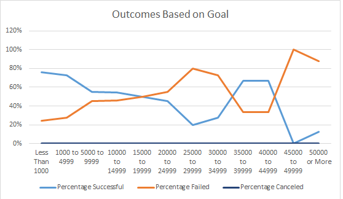

# kickstarter-analysis
**Using Excel to perform analysis on Kickstarter data to uncover trends**

## Overview of Project
Rising playwright, Louise, wants to start a crowdfunding campaign to help fund her play, *Fever*. She estimates needing a budget of over $10,000 and is worried about jumping into her first fundraising campaign. I used Excel to organize the current site data to assist Louise in better understanding campaigns from start to finish, so that she can set up her campaign to mirror other successful ones in the same category. 

## Analysis and Challenges
### Theater Outcomes Based on Launch Date
When looking at the outcomes for theater campaigns based on which month they were launched in, successful campaigns spiked when launched in May. The next highest months for successful campaigns to be launched were June and then July. The highest rate of failed campaigns were launched in May and October, but were still significantly lower than the rates of successful campaigns launched in these months. The below chart shows both the successful and failed campaigns increasing when launched in May, however, this may correlate to simply more campaigns being launch overall at this time, and therefore potentially a natural occurence. See the below line graph:

### Creation of Above Chart
In order to create the above graph, I first added a new column to the existing "Kickstarter" spreadsheet. The new column was called "Years", where I used the YEAR() function to pull the years from the "Date Created Conversion" column which I had previously created. The "Date Created Conversion" column was created to circumvent an obstacle that presented itself with the "launched_at" column, which holds the date on which each fundraiser was launched. This column showed the launch date with a series of numbers as a Unix timestamp date, so I converted these timestamps to a readable date. This allowed me to create the "Years" column, which was used in the above chart, as well as the "Parent Category" column and data for "successful", "failed", and "canceled" campaigns. I filtered the "Parent Category" for "theater" data, since Louise's project is only focusing on theater. I had to change the formatting to show only months in the row labels, and had to move the successful campaign data to the left and filter the data in descending order so that it would appear clearer on the chart. 

### Outcomes Based on Goal
When looking at the outcomes of campaigns based on the fundraising goal, the data shows that the highest rate of successful campaigns had the lowest fundraising goals (less than $1000). The second highest rate of successful campaigns was between $1000-$4999, and there was another, albeit smaller, spike in successful outcomes when campaigns set a $35000-$44999 goal. The highest rate of failed campaigns had $45000-$49999 as a fundraising goal and the second highest rate of failure was at $25000-$29999. See details for this data in the below chart:

### Creation of Above Chart
In order to create the above chart, I created a new sheet where I created a column showing the different goal ranges that are seen in the x axis of the above chart. I then pulled in data showing the number and percentage of campaigns that were successful, failed, and canceled. I used the COUNTIFS function for these data and the SUM function to show total projects for each section. 

## Results
Based on the Theater Outcomes by Launch Date chart, it is recommended that Louise consider launching her fundraising campaign in May, with June or July as alternates, since these are the months when previous campaigns had the most success. Since most campaigns failed in October, according to this data, I would discourage her from starting a campaign at this time. The Outcomes Based on Goals chart shows us that Louise may have more success if she creates a fundraising goal of below $1000 or between $35000-$44999, since the data shows that these are the fundraising goals of the most successful campaigns. These conclusions are based on only some aspects of the data and a fuller picture for Louise could be given by creating a chart showing the statistics reflecting the rates of success, failure, and cancellation for the subcategories of theater fundraisers, which could give more insight into the types of projects that do well. Also, for a deeper dive into the successful and failed campaigns based on their fundraising goal, more statistics showing the mean, median, upper and lower quartiles of the fundraising goals and amounts pledged for theater campaigns may be helpful to support Louise in deciding which amount will be best for her fundraising goal and what she can expect with potential pledge amounts based on previous data. 
