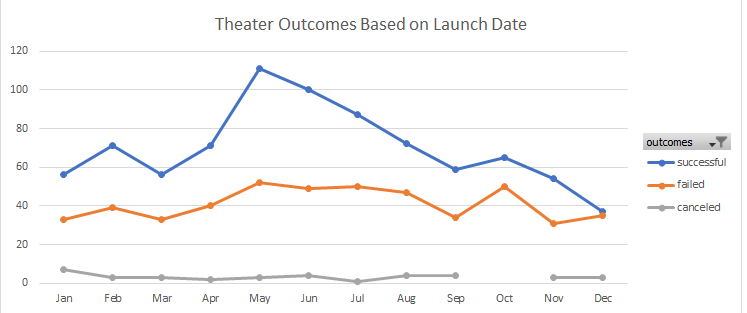

# kickstarter-analysis
## Performing analysis on Kickstarter data to uncover trends

**Overview of Project**
Rising playwright, Louise, wants to start a crowdfunding campaign to help fund her play, *Fever*. She estimates needing a budget of over $10,000 and is worried about jumping into her first fundraising campaign. I used Excel to organize the current site data to assist Louise in better understanding campaigns from start to finish, so that she can set up her campaign to mirror other successful ones in the same category. 

**Analysis and Challenges**
When looking at the outcomes for theater campaigns based on which month they were launched in, successful campaigns spiked when launched in May. The next highest months for successful campaigns to be launched were June and then July. The highest rate of failed campaigns were launched in May and October, but were still significantly lower than the rates of successful campaigns launched in these months. The below chart shows both the successful and failed campaigns increasing when launched in May, however, this may correlate to simply more campaigns being launch overall at this time, and therefore potentially a natural occurence. See the below line graph 

